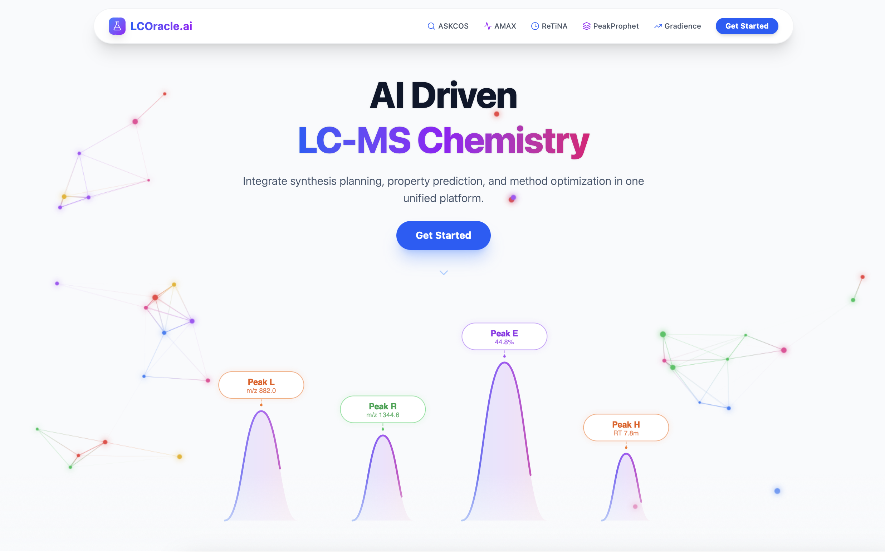

# LCOracle.ai: The Modern LC-MS Analytics Platform

LCOracle.ai is a comprehensive, AI-powered web application designed to revolutionize Liquid Chromatography-Mass Spectrometry (LC-MS) workflows. By integrating state-of-the-art machine learning models with a sleek, modern user interface, LCOracle.ai empowers chemists to predict, optimize, and analyze LC-MS data with unprecedented ease.

The platform unifies five powerful predictive modules: ASKCOS, AMAX, ReTiNA, PeakProphet, and Gradience, into a single, cohesive ecosystem for end-to-end method development and data analysis.

Current Version: **1.0.0**



## 🧿 Installation & Usage

LCOracle.ai is containerized with Docker for easy deployment.

### Prerequisites
- Docker Desktop
- Git

### Quick Start

1. **Clone the repository**
   ```bash
   git clone https://github.com/natelgrw/lcoracle_ai.git
   cd lcoracle_ai
   ```

2. **Run with Docker Compose**
   ```bash
   docker-compose up --build
   ```

   This will build and start both the backend and frontend services.
   - **Frontend**: Access the dashboard at `http://localhost:5173`
   - **Backend**: API documentation available at `http://localhost:8000/docs`

## 🔍 Featured Modules

### ASKCOS

The ASKCOS module uses MIT ASKCOS software to predict the most likely reaction products for a given set of reactants.

```
@article{askcos2025,
  title={ASKCOS: Open-Source, Data-Driven Synthesis Planning},
  author={Zhengkai Tu and Sourabh J. Choure and Mun Hong Fong and Jihye Roh and Itai Levin and Kevin Yu and Joonyoung F. Joung and Nathan Morgan and Shih-Cheng Li and Xiaoqi Sun and Huiqian Lin and Mark Murnin and Jordan P. Liles and Thomas J. Struble and Michael E. Fortunato and Mengjie Liu and William H. Green and Klavs F. Jensen and Connor W. Coley},
  journal={Accounts of Chemical Research},
  year={2025},
  volume={58},
  number={11},
  pages={1764--1775},
  doi={10.1021/acs.accounts.5c00155},
  url={https://askcos.mit.edu}
}
```

### AMAX

The AMAX module predicts the UV-Vis λ<sub>max</sub> for organic molecules in various solvents. Prediction models are from the AMAX model series.

Model Used: **AMAX_XGB1**

```
@modelcollection{amaxmodels,
  title={AMAX-Models: Machine Learning Models for Molecular Absorption Wavelength Prediction},
  author={Leung, Nathan},
  institution={Coley Research Group @ MIT}
  year={2025},
  howpublished={\url{https://huggingface.co/natelgrw/AMAX-Models}},
}
```

Documentation for AMAX models can be found [here](https://github.com/natelgrw/amax).

### ReTiNA

The ReTiNA module predicts elution times for compounds under specific LC-MS conditions.

Model Used: **ReTiNA_XG B1**

```
@modelcollection{retinamodels,
  title={ReTiNA-Models: Machine Learning Models for LC-MS Retention Time Prediction},
  author={Leung, Nathan},
  institution={Coley Research Group @ MIT}
  year={2025},
  howpublished={\url{https://huggingface.co/natelgrw/ReTiNA-Models}},
}
```

Documentation for ReTiNA models can be found [here](https://github.com/natelgrw/retina).

### PeakProphet

PeakProphet uses product prediction, property prediction, smart scoring, and optimal assignment algorithms to streamline compound identification by mapping detected LC-MS peaks to likely reaction products.

Version Used: **1.0.1**

```
@software{peakprophet,
  title = {PeakProphet: Automated Compound-Peak Matching for LC-MS},
  author = {Leung, Nathan},
  institution={Coley Research Group @ MIT},
  year={2025},
  url={https://github.com/natelgrw/peak_prophet}
}
```

Documentation for PeakProphet can be found [here](https://github.com/natelgrw/peakprophet).

### Gradience

Gradience takes the guesswork out of method development. Using Trust-Based Bayesian Optimization (TuRBO), it automatically designs LC gradients to maximize peak separation for your specific mixture.

Version Used: **1.0.0**

```
@software{gradience,
  title={Gradience: Automated LC-MS Gradient Optimization},
  author={Leung, Nathan},
  institution={Coley Research Group @ MIT},
  year={2025},
  url={https://github.com/natelgrw/gradience}
}
```

Documentation for Gradience can be found [here](https://github.com/natelgrw/gradience).

## 🪄 Citation

If you use LCOracle.ai in your research, please cite:

```
@software{lcoracle2025,
  title = {LCOracle.ai: The Modern LC-MS Analytics Platform},
  author = {Leung, Nathan},
  institution={Coley Research Group @ MIT},
  year={2025},
  url={https://github.com/natelgrw/lcoracle_ai}
}
```
